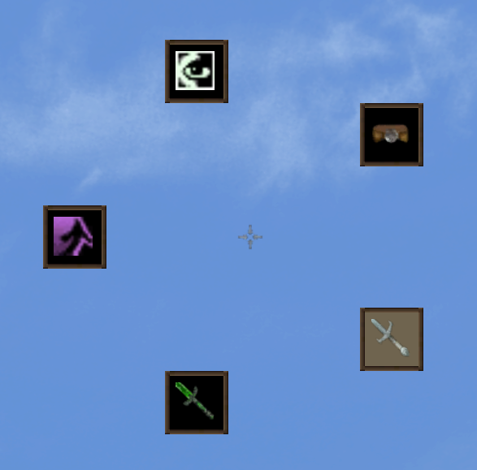

# Quick Action Mod for OpenMW

The Quick Action Mod adds a togglable HUD widget to perform actions. It currently supports equipping spells, enchants and weapons. It is fully configurable and customizable.

Requires OpenMW 0.49+.

